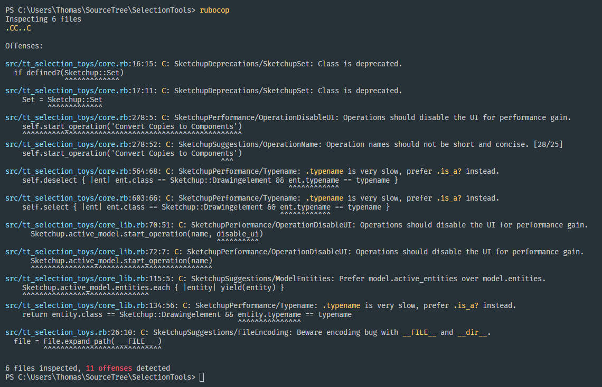

# RuboCop SketchUp

[](https://badge.fury.io/rb/rubocop-sketchup) [](https://ci.appveyor.com/project/thomthom/rubocop-sketchup) [](https://rubocop-sketchup.readthedocs.io/en/latest/?badge=latest)

Code analysis for SketchUp extensions using the [SketchUp Ruby API](http://ruby.sketchup.com/).

Tool intended to assist with development of SketchUp extension by providing static analysis for common issues.




## Installation

### TL;DR (Global Installation)

```sh
gem install rubocop -v 0.81
gem install rubocop-sketchup
```

### The Long Version

For more information about the installation process and how to manage your gem dependencies locally for a project refer to the dedicated section in the manual:

* [Manual: Requirements and Installation](https://rubocop-sketchup.readthedocs.io/en/latest/installation/)


## Usage

### TL;DR

Add `.rubocop.yml` in the root of your project:

```yaml
require: rubocop-sketchup

AllCops:
  DisabledByDefault: true
  DisplayStyleGuide: true
  SketchUp:
    SourcePath: src # Path to extension sources in project directory.
    EncryptedExtension: false # Enable if you plan to encrypt your extension.
    TargetSketchUpVersion: 2016 M1

SketchupDeprecations:
  Enabled: true

SketchupPerformance:
  Enabled: true

SketchupRequirements:
  Enabled: true

SketchupSuggestions:
  Enabled: true

SketchupBugs:
  Enabled: true
```

### The Long Version

* [Manual: Basic Usage](https://rubocop-sketchup.readthedocs.io/en/latest/basic_usage/)
* [Manual: Configuration](https://rubocop-sketchup.readthedocs.io/en/latest/configuration/)


### Formatters

### TL;DR

#### JSON

```bash
rubocop --format json --out results.json
```


#### Extension Review

```bash
rubocop -f extension_review -o report.html
```

### The Long Version

* [Manual: Formatters](https://rubocop-sketchup.readthedocs.io/en/latest/formatters/)


## The Cops

All cops are located under [`lib/rubocop/sketchup`](lib/rubocop/sketchup), and contain examples/documentation.

[Manual: Cops](https://rubocop-sketchup.readthedocs.io/en/latest/cops/)


## Contributing

1. Fork it
2. Create your feature branch (`git checkout -b my-new-feature`)
3. Commit your changes (`git commit -am 'Add some feature'`)
4. Push to the branch (`git push origin my-new-feature`)
5. Create new Pull Request


## License

`rubocop-sketchup` is MIT licensed.
